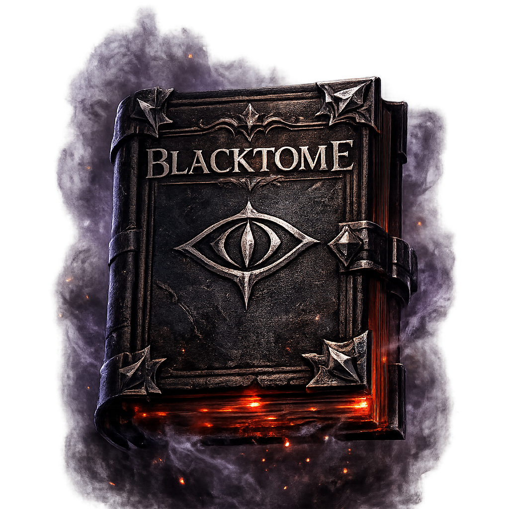

# Blacktome

<p align="center">
  
</p>

**Blacktome** is a dark-fantasy text RPG built with React, TypeScript, Vite, and Tailwind CSS. Players open a living grimoire, create a bound reader, make dangerous choices, write custom actions in AI mode, and survive a story shaped by health, energy, sanity, inventory, and consequence.

## Features

- **Branching dark-fantasy narration** with choice-based and custom-action turns.
- **Optional AI story engine** using an OpenAI-compatible chat completions API.
- **DND-style consequences** where player actions can damage, restore, curse, unlock, consume, or transform resources.
- **Survival stats** for health, energy, and sanity with mobile-friendly resource tracking.
- **Meaningful inventory** that can be gained, used, broken, traded, consumed, or tied to endings.
- **Responsive game UI** with desktop side panels, mobile action docks, focus reading mode, and animated resource alerts.
- **Local fallback scenes** so the game still works without AI configuration.

## Screens

- **Start screen**: choose a reader name and archetype before opening the tome.
- **Story screen**: read the current scene and decide the next action.
- **Path mode**: select from generated choices.
- **Write mode**: describe a custom action when AI mode is enabled.
- **Resource sheet**: view health, energy, sanity, and inventory on mobile.

## Tech Stack

- **React 19**
- **TypeScript**
- **Vite**
- **Tailwind CSS v4**
- **OpenAI-compatible chat completions API** for optional AI narration

## Getting Started

Install dependencies:

```bash
npm install
```

Start the development server:

```bash
npm run dev
```

Build for production:

```bash
npm run build
```

Run lint checks:

```bash
npm run lint
```

## AI Configuration

Blacktome can run without AI by using local fallback scenes. To enable AI narration, configure an OpenAI-compatible provider through environment variables or the in-game settings panel.

Create a local environment file:

```bash
VITE_BLACKTOME_AI_BASE_URL=https://api.example.com/v1
VITE_BLACKTOME_AI_MODEL=provider/model-name
VITE_BLACKTOME_AI_API_KEY=your-api-key
```

The AI engine is instructed to:

- Resolve the player’s exact action before moving the story forward.
- End every scene with a clear decision point.
- Keep generated choices synchronized with the visible story text.
- Use health, energy, sanity, and inventory as real gameplay systems.
- Guide each run toward one of several possible endings.

## Project Structure

```text
src/
  assets/              App images and fonts
  components/          React UI components
  config/              AI runtime configuration
  data/                Character archetype data
  hooks/               Game state orchestration
  services/            Story engine and AI request logic
  types/               Shared TypeScript models
  utils/               Save/settings storage helpers
public/
  blacktome.png        Favicon, app icon, and README image
```

## Icon

The Blacktome icon is used as:

- Browser favicon in `index.html`.
- Apple touch icon in `index.html`.
- Start screen hero image in `src/components/StartScreen.tsx`.
- README artwork via `public/blacktome.png`.

## Design Goals

Blacktome is designed to feel like a playable gothic tabletop session: each turn should resolve what the player tried, change the world, pressure the player into another decision, and make resources matter. Good choices can reveal paths, recover strength, or unlock endings. Bad choices can drain sanity, destroy items, cause injury, or end the run.

## License

Blacktome is open source under the [MIT License](LICENSE).
